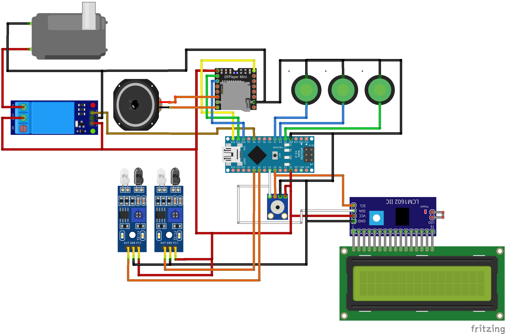

# voicetemp
This is my project for build a device for measuring temperature body. The device have "VOICE" feature in two languages, so you can set laguange what do you want.

Materials:
1. Arduino Nano
2. Temperature Sensor (MLX90614)
3. IR Obstacle Sensor
4. DFRobot DFPlayer Mini
5. LCD 16x2 + I2C Module
6. Speaker
7. Relay
8. Mini Pump 5V
9. Push Button

The firmware uses several libraries, including:
1. Adafruit MLX90614 Library (https://github.com/adafruit/Adafruit-MLX90614-Library/)
2. DFRobot DFPlayer Mini Library (https://github.com/DFRobot/DFRobotDFPlayerMini/archive/1.0.3.zip)
3. LiquidCrystal I2C Library (https://github.com/johnrickman/LiquidCrystal_I2C)
4. Software Serial Library (built-in Arduino)
5. EEPROM Library (buil-in Arduino)

Schematic for this project:

